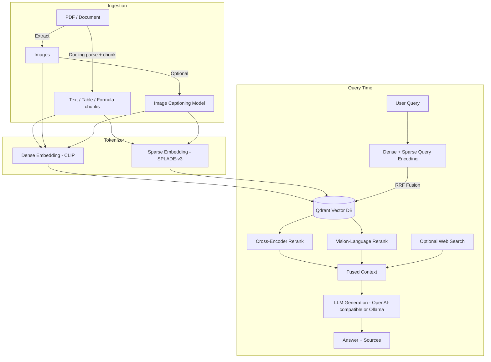

# Complete RAG — Hybrid Search, Image Captioning & Tree RAG

A locally-run, multimodal Retrieval-Augmented Generation (RAG) engine. It combines dense and sparse hybrid vector search, cross-encoder and vision-language reranking, optional image captioning, RAPTOR-style hierarchical summarization ("Tree RAG"), live web search augmentation, and bulk ingestion of Wikipedia or any Hugging Face dataset — all exposed through a FastAPI backend, a command-line interface, and a React web GUI.

All retrieval and reranking models run locally through Hugging Face `transformers` / `sentence-transformers`. Answer generation can be routed to any OpenAI-compatible endpoint (OpenAI, LM Studio, vLLM, etc.) or to a local model served through Ollama.

## Table of Contents

- [Features](#features)
- [Architecture](#architecture)
- [Models Used](#models-used)
- [Tech Stack](#tech-stack)
- [Getting Started](#getting-started)
- [Usage](#usage)
- [CLI Reference](#cli-reference)
- [REST API Reference](#rest-api-reference)
- [Project Structure](#project-structure)
- [Configuration](#configuration)
- [License](#license)
- [References](#references)

## Features

- **Multimodal document ingestion** — PDFs (and other formats) are parsed with Docling, preserving text, tables, formulas (as LaTeX), and embedded images with page-level provenance.
- **Hybrid retrieval** — dense (CLIP) and sparse (SPLADE) vectors are fused with Qdrant's Reciprocal Rank Fusion (RRF) so that both semantic and exact lexical matches contribute to ranking.
- **Two-stage reranking** — a text cross-encoder and a vision-language reranker rescore the fused candidates before they reach the LLM, including reranking of retrieved images against the query.
- **Optional image captioning** — pluggable captioners (Moondream2, BLIP, Florence-2, or LLaVA) generate captions that are embedded and indexed alongside each image, improving image retrievability.
- **Tree RAG** — an optional RAPTOR-inspired pipeline that clusters chunks with Gaussian Mixture Models, summarizes each cluster with the configured LLM, and recursively re-embeds the summaries into higher tree levels, so both fine-grained and holistic context are retrievable.
- **Web-augmented answers** — DuckDuckGo search plus Trafilatura content extraction can supplement or force-override local retrieval, with an optional self-correcting loop that rewrites the query or escalates to web search when an answer looks insufficient.
- **Bulk corpus ingestion** — multiprocess, streaming ingestion of the full Wikipedia dump or an arbitrary Hugging Face `datasets` dataset.
- **Three interfaces** — a Python CLI (`main.py`), a FastAPI HTTP/streaming API (`api.py`), and a React GUI (chat, ad-hoc query, and a Qdrant collection dashboard).
- **Swappable collections** — multiple named Qdrant collections can be created and switched between at runtime.

## Architecture



If **Tree RAG** is enabled at ingestion time, leaf chunks are additionally clustered (Gaussian Mixture Models), summarized by the LLM, and re-embedded as parent nodes — recursively, up to a configurable depth — with every level stored in and retrievable from the same Qdrant collection.

## Models Used

The `Tokenizer` class (`backend/Tokenizer.py`) wraps every embedding, sparse-retrieval, reranking, and captioning model used by the pipeline. All defaults are Hugging Face model IDs and can be overridden via the CLI, the `/config/tokenizer` API endpoint, or the GUI's "Embedding & Caption Models" dialog.

| Role | Default model | Library |
|---|---|---|
| Dense (image + text) embedding | `clip-ViT-B-32` | `sentence-transformers` |
| Sparse lexical embedding | `naver/splade-v3` | `transformers` |
| Text cross-encoder reranker | `cross-encoder/ms-marco-MiniLM-L-12-v2` | `sentence-transformers` |
| Vision-language reranker | `nvidia/llama-nemotron-rerank-vl-1b-v2` | `transformers` |
| Image captioner (optional, user-selectable) | `vikhyatk/moondream2`, `Salesforce/blip-image-captioning-base`, `microsoft/Florence-2-large`, or `llava-hf/llava-1.5-7b-hf` | `transformers` |
| Answer generation | Any OpenAI-compatible chat model (e.g. `gpt-4o-mini`), or a local model served via Ollama | `openai` / REST |

**Dense embedding — CLIP.** `clip-ViT-B-32`, loaded through `sentence-transformers`, embeds both document images and text chunks into a shared 512-dimensional space, which is what makes text-to-image and image-to-text retrieval possible. CLIP was introduced by Radford et al. [1]; the `sentence-transformers` wrapper used to load it is described by Reimers and Gurevych [2].

**Sparse embedding — SPLADE-v3.** `naver/splade-v3` produces a sparse, vocabulary-sized vector via log-saturated ReLU activations over masked-language-model logits, giving the system exact keyword / term-expansion matching to complement CLIP's dense similarity. SPLADE-v3 is described by Lassance et al. [3].

**Cross-encoder reranker.** `cross-encoder/ms-marco-MiniLM-L-12-v2` jointly encodes the query and each candidate passage (or image caption) to produce a relevance score, and is used as a second-stage reranker over the fused hybrid results. It is a MiniLM-based model [4] fine-tuned on the MS MARCO passage ranking dataset [5].

**Vision-language reranker.** `nvidia/llama-nemotron-rerank-vl-1b-v2` is a multimodal cross-encoder that scores a query directly against a document image (and its caption), and is used specifically to rerank retrieved page images [6].

**Image captioning (optional).** When enabled, one of four captioners generates a text caption for every extracted image, which is then embedded (dense + sparse) so images become retrievable by text query even without a caption match at reranking time:
- **Moondream2** — a small, open-weight vision-language model [7].
- **BLIP** (`Salesforce/blip-image-captioning-base`) — bootstrapped vision-language pretraining for captioning [8].
- **Florence-2** (`microsoft/Florence-2-large`) — a unified, prompt-based vision foundation model [9].
- **LLaVA** (`llava-hf/llava-1.5-7b-hf`) — a visual instruction-tuned multimodal model [10].

**Tree RAG clustering.** Cluster assignment over chunk/summary embeddings uses Gaussian Mixture Models from scikit-learn [12], following the recursive embed–cluster–summarize approach introduced by RAPTOR [11].

**Hybrid fusion.** Dense and sparse result lists are combined using Qdrant's Reciprocal Rank Fusion, based on the method of Cormack, Clarke, and Buettcher [13], via Qdrant's native `FusionQuery` [14].

**Generation LLM.** The generation step is provider-agnostic: `OpenAILLM` talks to any OpenAI-compatible `/v1/chat/completions` endpoint (OpenAI's own API [22], or a self-hosted OpenAI-compatible server such as LM Studio or vLLM), and `OllamaLLM` talks to a local Ollama server [23]. No specific generation model is hard-coded — the model string is passed in at configuration time.

## Tech Stack

**Backend (Python, `backend/`)**
- FastAPI + Uvicorn — HTTP API and streaming (SSE) chat endpoint [20]
- PyTorch, Hugging Face `transformers`, `sentence-transformers` — model loading and inference
- Qdrant Client — vector database access, hybrid queries, RRF fusion [14]
- Docling — PDF/document parsing, layout-aware chunking, table and formula extraction, with EasyOCR for scanned pages [15]
- LangChain Text Splitters (`RecursiveCharacterTextSplitter`) — chunking [16]
- Hugging Face `datasets` — streaming ingestion of Wikipedia [17] and arbitrary HF datasets
- `ddgs` — DuckDuckGo search [19]
- Trafilatura — clean text extraction from fetched web pages [18]
- scikit-learn — Gaussian Mixture Models for Tree RAG clustering [12]
- `openai` Python SDK — OpenAI-compatible chat completions

**Frontend (`frontend/`)**
- React 19 + Vite [21]
- Ant Design and Radix UI / shadcn-style primitives for the component library
- React Router, Recharts, Tailwind CSS

**Infrastructure**
- Qdrant — vector database (run locally, typically via Docker) [14]
- Ollama (optional) — local LLM serving [23]

## Getting Started

### Prerequisites

- Python 3.11 or later
- Node.js 18 or later
- Docker (recommended, for running Qdrant)
- A CUDA GPU or Apple Silicon (MPS) is recommended for the embedding, reranking, and captioning models; CPU also works but is slower
- An OpenAI-compatible API key, **or** a running Ollama instance, for answer generation

### 1. Start Qdrant

```bash
docker run -p 6333:6333 -p 6334:6334 qdrant/qdrant
```

### 2. Backend setup

```bash
git clone https://github.com/Vans1000/Complete-Rag-Hybrid-Search-Image-Captioning-Tree-Rag.git
cd Complete-Rag-Hybrid-Search-Image-Captioning-Tree-Rag/backend

python -m venv .venv
source .venv/bin/activate   # Windows: .venv\Scripts\activate

pip install torch pillow numpy scikit-learn \
            transformers sentence-transformers \
            qdrant-client \
            docling docling-core \
            langchain-text-splitters \
            datasets \
            ddgs aiohttp trafilatura httpx \
            openai requests \
            fastapi uvicorn pydantic python-multipart
```


### 3. Frontend setup

```bash
cd ../frontend
npm install
```

The Vite dev server proxies `/config`, `/ingest`, `/chat`, `/collections`, `/dashboard`, and `/health` requests to `http://127.0.0.1:8000`, so the backend must be running on port 8000 (the default) for the GUI to work.

## Usage

### Run the full stack (API + GUI)

```bash
# Terminal 1 — backend API
cd backend
python main.py --api --collection_name my_collection

# Terminal 2 — frontend
cd frontend
npm run dev
```

Open the printed Vite URL (default `http://localhost:5173`). From the GUI you can configure the LLM provider and tokenizer models, create/switch Qdrant collections, upload documents (optionally with Tree RAG enabled), import a Hugging Face dataset, chat with the corpus, and inspect indexed points on the dashboard page.

### CLI: ingest a document and ask a question

```bash
python main.py \
  --collection_name my_collection \
  --documents ./papers/example.pdf \
  --llm_provider openai --llm_model gpt-4o-mini \
  --ask "What does the document say about X?"
```

### CLI: interactive chat

```bash
python main.py --collection_name my_collection --llm_provider ollama --llm_model llama3.1 --chat
```

Inside chat mode: `/web` toggles web-augmented retrieval, `/forceweb` forces every answer to prioritize live web results, `/clear` resets history, `/exit` quits.

### CLI: ingest Wikipedia or a Hugging Face dataset

```bash
# Full English Wikipedia (streamed, multiprocess)
python main.py --collection_name wiki --wikipedia --workers 4

# Any Hugging Face dataset
python main.py --collection_name my_dataset \
  --huggingface_dataset squad --hf_text_col context --workers 4
```

## CLI Reference

Selected flags from `backend/main.py` (`python main.py --help` for the full list):

| Flag | Description |
|---|---|
| `--collection_name` (required) | Qdrant collection to read/write |
| `--documents`, `--document_dir` | File(s) or directory to ingest |
| `--tree_rag` | Enable hierarchical Tree RAG ingestion |
| `--dense_model`, `--sparse_model`, `--cross_encoder_model`, `--vision_rerank_model`, `--caption_model` | Override any tokenizer model |
| `--wikipedia` | Ingest the full Wikipedia dataset |
| `--huggingface_dataset` | Ingest an arbitrary HF dataset by path |
| `--batch_size`, `--workers` | Tune bulk ingestion throughput |
| `--chat` | Start interactive CLI chat |
| `--ask` | Ask a single question non-interactively |
| `--llm_provider` | `openai` or `ollama` |
| `--llm_model`, `--llm_base_url` | Model name / endpoint override |
| `--use_web`, `--force_web`, `--ingest_web` | Web search augmentation controls |
| `--self_correction` | Enable the query-rewrite / web-escalation retry loop |
| `--api`, `--api_host`, `--api_port` | Start the FastAPI server instead of CLI mode |

## REST API Reference

Selected endpoints from `backend/api.py` (served at `http://localhost:8000` by default):

| Method & Path | Purpose |
|---|---|
| `POST /config/llm` | Configure the LLM provider/model |
| `POST /config/tokenizer` | Reconfigure embedding/reranking/captioning models |
| `POST /config/websearch` | Configure web search result count |
| `POST /config/tree_rag` | Enable/disable Tree RAG for future ingests |
| `POST /ingest/file` | Upload and index a document (background task) |
| `GET /ingest/progress/{upload_id}` | Poll ingestion progress |
| `POST /ingest/web` | Ingest a URL or web search results |
| `POST /ingest/huggingface` | Bulk-ingest a Hugging Face dataset |
| `POST /query` | Hybrid vector search only, no LLM generation |
| `POST /chat` | RAG chat (non-streaming) |
| `POST /chat/stream` | RAG chat (Server-Sent Events streaming) |
| `GET /collections` / `POST /collections` / `POST /collections/switch` | Manage Qdrant collections |
| `GET /dashboard/stats` / `POST /dashboard/points` | Collection statistics and point browsing |
| `GET /health` | Service health check |

## Project Structure

```
Advanced RAG with GUI/
├── backend/
│   ├── main.py              # CLI entry point
│   ├── api.py                # FastAPI application
│   ├── Tokenizer.py           # Dense/sparse embedding, reranking, captioning
│   ├── VectorDatabase.py      # Qdrant collection + hybrid search
│   ├── File.py                # Docling-based document parsing & ingestion
│   ├── TreeRag.py             # RAPTOR-style hierarchical summarization
│   ├── LLM.py                 # OpenAI-compatible / Ollama LLM clients + RAG chat loop
│   ├── WebSearch.py           # DuckDuckGo search + web content ingestion
│   ├── Wikipedia.py           # Streaming Wikipedia ingestion
│   └── HuggingFaceDataset.py  # Streaming ingestion of arbitrary HF datasets
└── frontend/
    └── src/
        ├── pages/             # ChatPage, QueryPage, DashboardPage
        ├── components/        # NavBar, LLM/Tokenizer config modals, collection selector, etc.
        └── context/           # Shared app state (AppContext)
```

## Configuration

- **LLM provider**: set via `--llm_provider`/`--llm_model` on the CLI, `POST /config/llm`, or the GUI's LLM dialog. `openai` mode accepts any OpenAI-compatible `base_url` (OpenAI itself, LM Studio, vLLM, etc.); `ollama` mode talks to a local Ollama server.
- **Embedding/reranking/captioning models**: set via CLI flags, `POST /config/tokenizer`, or the GUI's "Embedding & Caption Models" dialog. Changing these reloads the corresponding models into memory; previously indexed vectors in Qdrant are unaffected.
- **Collections**: multiple Qdrant collections can be created and switched between without restarting the backend.

## How was AI used for this project?
Most of the code for this project was written by hand. However, AI was used in researcg, debugging and generating the readme (especially for finding citations). 


## License

Released under the [MIT License](LICENSE). Copyright (c) 2026 Vanshdeep Singh.

## References

1. Radford, A., Kim, J. W., Hallacy, C., Ramesh, A., Goh, G., Agarwal, S., Sastry, G., Askell, A., Mishkin, P., Clark, J., Krueger, G., & Sutskever, I. (2021). *Learning Transferable Visual Models From Natural Language Supervision* (CLIP). ICML 2021. https://arxiv.org/abs/2103.00020
2. Reimers, N., & Gurevych, I. (2019). *Sentence-BERT: Sentence Embeddings using Siamese BERT-Networks*. EMNLP 2019. https://arxiv.org/abs/1908.10084
3. Lassance, C., Déjean, H., Formal, T., & Clinchant, S. (2024). *SPLADE-v3: New Baselines for SPLADE*. https://arxiv.org/abs/2403.06789
4. Wang, W., Wei, F., Dong, L., Bao, H., Yang, N., & Zhou, M. (2020). *MiniLM: Deep Self-Attention Distillation for Task-Agnostic Compression of Pre-Trained Transformers*. NeurIPS 2020. https://arxiv.org/abs/2002.10957
5. Bajaj, P., Campos, D., Craswell, N., Deng, L., Gao, J., Liu, X., Majumder, R., McNamara, A., Mitra, B., Nguyen, T., Rosenberg, M., Song, X., Stoica, A., Tiwary, S., & Wang, T. (2016). *MS MARCO: A Human Generated MAchine Reading COmprehension Dataset*. https://arxiv.org/abs/1611.09268
6. NVIDIA. *llama-nemotron-rerank-vl-1b-v2* model card. https://huggingface.co/nvidia/llama-nemotron-rerank-vl-1b-v2
7. Korrapati, V. *Moondream2*. https://huggingface.co/vikhyatk/moondream2
8. Li, J., Li, D., Xiong, C., & Hoi, S. (2022). *BLIP: Bootstrapping Language-Image Pre-training for Unified Vision-Language Understanding and Generation*. ICML 2022. https://arxiv.org/abs/2201.12086
9. Xiao, B., Wu, H., Xu, W., Dai, X., Hu, H., Lu, Y., Zeng, M., Liu, C., & Yuan, L. (2024). *Florence-2: Advancing a Unified Representation for a Variety of Vision Tasks*. CVPR 2024. https://arxiv.org/abs/2311.06242
10. Liu, H., Li, C., Wu, Q., & Lee, Y. J. (2023). *Visual Instruction Tuning* (LLaVA). NeurIPS 2023. https://arxiv.org/abs/2304.08485
11. Sarthi, P., Abdullah, S., Tuli, A., Khanna, S., Goldie, A., & Manning, C. D. (2024). *RAPTOR: Recursive Abstractive Processing for Tree-Organized Retrieval*. ICLR 2024. https://arxiv.org/abs/2401.18059
12. Pedregosa, F., et al. (2011). *Scikit-learn: Machine Learning in Python*. Journal of Machine Learning Research, 12, 2825–2830. https://jmlr.org/papers/v12/pedregosa11a.html
13. Cormack, G. V., Clarke, C. L. A., & Buettcher, S. (2009). *Reciprocal Rank Fusion Outperforms Condorcet and Individual Rank Learning Methods*. SIGIR 2009.
14. Qdrant. *Qdrant Vector Database* (query fusion / hybrid search documentation). https://qdrant.tech/documentation/
15. Livathinos, N., Auer, C., Lysak, M., Nassar, A., Dolfi, M., Vagenas, P., Berrospi, C., Omenetti, M., Dinkla, K., Kim, Y., Gupta, S., Teixeira de Lima, R., Weber, V., Morin, L., Meijer, I., Kuropiatnyk, V., & Staar, P. W. J. (2024). *Docling Technical Report*. IBM Research. https://arxiv.org/abs/2408.09869
16. Chase, H. (2022). *LangChain* [Software]. https://github.com/langchain-ai/langchain
17. Wikimedia Foundation. *Wikipedia* dataset (dump `20231101.en`), distributed via Hugging Face Datasets. https://huggingface.co/datasets/wikimedia/wikipedia
18. Barbaresi, A. (2021). *Trafilatura: A Web Scraping Library and Command-Line Tool for Text Discovery and Extraction*. ACL-IJCNLP 2021 System Demonstrations.
19. DDGS contributors. *ddgs* — DuckDuckGo Search Python library. https://github.com/deedy5/ddgs
20. Ramírez, S. *FastAPI* [Software]. https://fastapi.tiangolo.com
21. Meta Platforms, Inc. *React* [Software]. https://react.dev
22. OpenAI. *OpenAI API Reference* (Chat Completions). https://platform.openai.com/docs
23. Ollama. *Ollama* [Software] — local large language model runner. https://ollama.com
